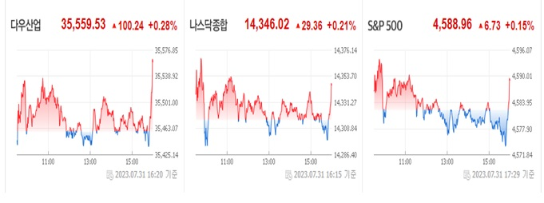

<h2>이 프로젝트는 키움증권API 기반으로 작성된 증권트레이드입니다.</h2>

### 1. 라이선스 

이 프로젝트의 모든 파일은 GPL-2.0 라이선스로 보호됩니다.

본 프로그램은 자유 소프트웨어입니다. 여기에 명시된 제한 하에 자유롭게 복사, 배포, 수정, 합성 및/또는 배포할 수 있습니다.

이 프로그램은 "있는 그대로" 제공됩니다. 

이에 대한 보증 없이 사용할 수 있는 사본은 이 파일과 함께 제공됩니다. 

상세한 보증과 함께 GNU 일반 공중 사용 허가서를 참조하십시오.

GNU 일반 공중 사용 허가서에 대한 복사본은 다음 위치에서 얻을 수 있습니다.

<https://www.gnu.org/licenses/gpl-2.0.html>

### 2. 소스 오픈에 대한 이유
   
이 소스는 개인적으로 사용하기 위해 틈틈히 만들고 있던 소스인데, 며칠 전 아래와 같은 거래를 보고 매우 놀라게 되었다. 다우산업, 나스닥, S&P500 이(가) 장마감 3분을 남기고 갑자기 상승 전환을 하며 7월 31일(월봉)을 양전 하는 것을 보게 되었다. 

   
이 현상은 주식 시장을 움직이는 프로그램이 있다고 이해를 해야 한다.
   미국(세계)의 증시는 7월봉이 양봉을 해야하는 중요한 이유가 있었던 것이다. 이미 정해진 시나리오가 밀리자 주식 자동화 프로그램은 많은 무리수를 두면서 양봉으로 전환을 하게 되었다. 같은 시간에 동시다발적으로 일사불란 하게 움직이는 이유가 단지 기술적 판등으로는 이해가 되지 않느다.

   
우리는 이 주식 자동화 프로그램이 어떻게 작동하는지 원리를 파악할 필요가 있고, 모든 상황에 대응할 수 있는 대응 프로그램이 필요 하게 되었다. 

   
그러하여, 그동안 작업 하던 소스를 오픈하고 공등 대응을 준비해야 한다.

   
   

   나는 그동안 사용하던 소스를 오픈한다. 아직 완료된 코드는 아니다. 앞으로도 뜸뜸이 버전업을 해서 프로젝트를 진행 할 예정이다.

   추후, 트레이드 기능 추가, 선물/옵션, 해외 선물/옵션 등을 순차적으로 지원할 예정이다.

### 3. 소스 설치시 유의사항
    - 프로그램 설치 및 운영은 반드시 자기 자신의 판단과 책임하에 해야 하며, 자신의 여유자금으로 분산 투자하거나 모의투자로 프로그램을 사전 점검하여 주십시오.
    - 프로그램 매매에 위임하더라도 투자손익은 프로그램 설치 자신에 귀속되며, 투자원금의 보장 도는 손실보전 약속은 법률적으로 효력이 없습니다.

### 4. 프로그램 소프 파일 설치

####  기본적으로 파이선에서 설치해야 할 모듈들이다.

  <ul>pip install tabulate</ul>
  <ul>pip install eventhandler</ul>
  <ul>pip install plotly</ul>
  <ul>pip install Slacker</ul>
  <ul>pip install pywebview</ul>
  <ul>pip install PyQtWebkit</ul>

  <ul>pip install pycryptodomex</ul>
  <ul>pip install crypto</ul>
  <ul>pip install pycrypto</ul>

####  키움증권 API는 WIN32 지원하기 때문에 conda 환경 설정에서 win32 로 설정해야 한다.
    1. win-32, Python 2.7 설치
    - conda create -n py27_32
    - conda activate py32_32
    - conda config --env --set subdir win-32
    - conda install python=2.7

    2. win-64, Python 3.7 설치

    - conda create -n py32_64
    - conda activate py37_64
    - conda config --env --set subdir win-64
    - conda install python=3.7

####  위외 같이 기본 모듈을 설치 하기 힘들면 개발을 하기 위해서 사용한 conda env 파일(<a href="https://drive.google.com/drive/folders/14soNPRwqHd8osdCd9IHT9NLngebvgpWt?usp=sharing">개발툴파일들</a>)을 받아서 ~/anaconda3/envs/ 에 압축을 풀어 사용합니다.

### 5. 프로그램 실행
  
  #### 실행를 하려면, 아래와 같이 진행 하면 됩니다.
  

  
  d: base> anaconda 설치 

  
  d: base> unzip ~/anaconda3/envs/ 에 'py-ats.zip' 압축 풀기 

  
  d: base> activate py-ats 

  
  d: py-ats> python ats_main.py 

  

### 6. 참고 사이트
  
<a href="https://wikidocs.net/book/110">파이썬으로 배우는 알고리즘 트레이딩 (개정판-2쇄)</a>

  
<a href="https://wikidocs.net/5856">자동 버전 처리 스크립트</a>

  
<a href="http://pyqt.sourceforge.net/Docs/PyQt4/qwebpage.html">Webview for python</a>

  
   
   
=================================================
 
 

   

